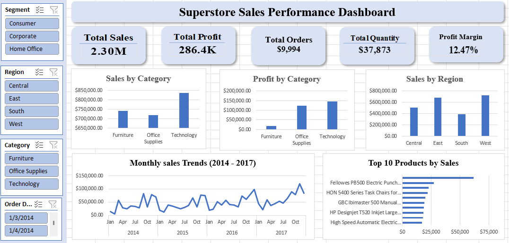

# 📊 Sales Performance Dashboard | Excel

An interactive Sales Performance Dashboard built in Microsoft Excel using PivotTables, PivotCharts, and Slicers to analyze sales performance across multiple business dimensions.

This project demonstrates how Excel can be used to transform raw sales data into an interactive dashboard that supports business decision-making.

---

## Dashboard Preview

---

## Executive Summary

This interactive Sales Performance Dashboard provides an overview of business performance using the Superstore dataset. The dashboard was developed in Microsoft Excel to help users monitor key performance indicators (KPIs), analyze sales trends, and evaluate performance across product categories and regions.

Users can interactively filter the data by Region, Customer Segment, Product Category, and Order Date using slicers. The dashboard updates automatically, allowing decision-makers to explore different perspectives and identify performance patterns.

---- 

## Project Objectives

This project was created to:

- Build an interactive sales dashboard in Microsoft Excel.
- Transform raw transactional data into meaningful business insights.
- Practice dashboard design using PivotTables, PivotCharts, and Slicers.
- Present key performance indicators (KPIs) to support business decision-making.
---- 
## Dashboard Features

- KPI cards
- Sales by Category
- Profit by Category
- Sales by Region
- Monthly Sales Trend (2014–2017)
- Top 10 Products by Sales
- Interactive slicers for dynamic filtering

---

## Business Questions Answered

- What are the overall sales and profit?
- Which product category generates the highest sales?
- Which region performs best?
- How do sales change over time?
- What are the top 10 best-selling products?
- How does profit margin change with different filters?

---

## Business Insights

- Total sales reached **$2.30M**, generating **$286K**in profit and a **12.47% profit margin**.
- **Technology** was the strongest-performing category, leading both sales and profitability. 
- The **West** region consistently outperformed other regions in total sales. 
- Sales generally increased from **2014–2017**, although seasonal fluctuations were observed throughout the period. 
- The Top 10 Products analysis highlights the products contributing most significantly to revenue.

## Skills Demonstrated

- Microsoft Excel
- PivotTables
- PivotCharts
- Dashboard Design
- KPI Development
- Data Visualization
- Business Analysis
- Interactive Reporting
- Slicers

---

## What I Learned

Through this project, I strengthened my ability to:

- Design interactive dashboards in Microsoft Excel.
- Build KPI cards and dynamic PivotCharts.
- Use slicers to create an intuitive user experience.
- Transform raw sales data into actionable business insights.
- Communicate findings through clear data visualization and storytelling.

---
## Dataset

This project uses the Superstore Sales dataset, a commonly used dataset for learning data analytics and business intelligence.
You can access the dataset used in this project:    
https://www.kaggle.com/datasets/vivek468/superstore-dataset-final/data

---

## Tools Used

- Microsoft Excel
- PivotTables
- PivotCharts
- Slicers
- Custom Number Formatting

---
## Files in This Repository

| File | Description |
|------|-------------|
| `Dashboard.xlsx` | Interactive Excel dashboard |
| `dashboard.png` | Dashboard preview image |
| `Superstore.xlsx` | Source dataset |
| `README.md` | Project documentation |
---
## How to Use
1.	Download the Excel file (.xlsx) from the repository.
2.	Open it in Microsoft Excel.
3.	Explore the interactive dashboard and filter data as needed.

---

## Connect with me
I'm actively building data analytics projects and welcome feedback.
LinkedIn: (https://www.linkedin.com/in/roza-aissaoui-273119337/)

If you found this project helpful or interesting, consider giving it a star. It helps support my work and motivates me to create more analytics projects. ⭐

