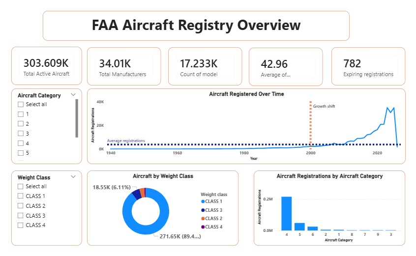
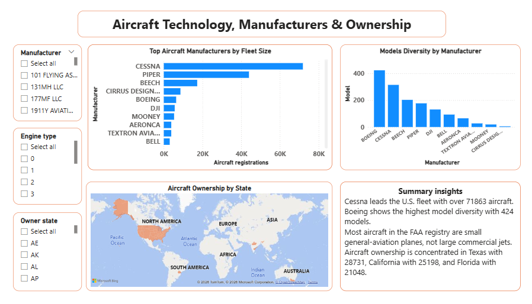

# FAA Aircraft Registry Analytics: End-to-End ETL Pipeline & Interactive Dashboard

This project delivers a complete data engineering workflow using the FAA Aircraft Registry dataset. It includes raw data ingestion, cleaning, and transformation in Python, loading into PostgreSQL, and building an interactive Power BI dashboard for insights into aircraft registrations, manufacturers, model diversity, and ownership distribution.
---
## 📂 Executive overview
📄[Download Executive Summary (PDF)](doc/faa-aircraft-registry-executive-summary.pdf)
 
---
## 📥 Data Source
FAA Aircraft Registry — MASTER & ACFTREF files
(Data snapshot: ##January 2025##)

🔗 Download: https://www.faa.gov/licenses_certificates/aircraft_certification/aircraft_registry/  

---
## 🚀 Project Workflow

### **1. Extract**
- Loaded FAA raw registry files:
  - MASTER.txt (aircraft registrations)
  - ACFTREF.txt (aircraft reference specifications)
- Parsed files into Pandas DataFrames
- Saved raw snapshots:
  - master_raw.csv
  - reference_raw.csv

### **2. Transform**
MASTER (Fact Table)
 - Selected relevant columns including n_number, mfr_mdl_code, dates, owner_state
 - Renamed columns to consistent snake_case
 - Filtered active aircraft only (registration_status = 'V')
 - Converted date and numeric fields
 - Handled missing categorical values with "UNKNOWN" and numeric with NAN
 - Normalized text fields and removed duplicates
 - Output: aircraft_master_clean.csv

ACFTREF (Dimension Table)
 - Cleaned column names and data types
 - Retained manufacturer, model, engine, and weight class attributes
 - Filled missing categorical values with "UNKNOWN"
 - Dropped records with missing primary key (mfr_mdl_code)
 - Output: aircraft_reference_clean.csv
Join
 - Left join MASTER with ACFTREF on mfr_mdl_code
 - Filled missing reference attributes where necessary
 - Final analytics dataset:faa_analytics_dataset.csv

### **3. Load**
- Created PostgreSQL tables for:
  - Cleaned MASTER
  - Cleaned ACFTREF
  - Final analytics dataset
- Loaded data using SQLAlchemy
- Verified row counts and schema integrity
---
## 📊 Power BI Dashboard

Built a two‑page Power BI dashboard:
### ** Page 1 – Executive Overview**

- Total active aircraft
- Total manufacturers and models
- Average aircraft age
- Expiring registrations
- Registrations over time
- Weight class and category distribution

#### **Page 2 – Manufacturers & Ownership**
- Top manufacturers by fleet size
- Model diversity by manufacturer
- Aircraft ownership by state
- Executive summary insights

 
📄 [Download full dashboard (PDF)](dashboard/faa-aircraft-registry-analytics-dashboard.pdf)

---
## 📊 Key Insights
- **Cessna leads the U.S. fleet** with over 71K registered aircraft.
- **Boeing shows the highest model diversity** with 424 unique models.
- **Most aircraft in the FAA registry are small general‑aviation planes**, not large commercial jets.
- **Texas, California, and Florida have the highest aircraft ownership**
---

## 🛠 Technologies Used
- **Python** (Pandas)
- **Jupyter Notebooks**
- **PostgreSQL**
- **Power BI**
- **FAA Aircraft Registry Dataset**

---

## ▶️ Usage

1.	Run extract.ipynb to ingest FAA raw files
2.	Run transform.ipynb to clean and enrich the data
3.	Run load.ipynb to push data into PostgreSQL
4.	Open faa_aircraft_dashboard.pbix in Power BI

---

## 📬 Contact  
If you have feedback or suggestions, feel free to open an issue or connect with me on LinkedIn:  
[LinkedIn Profile](https://www.linkedin.com/in/roza-aissaoui-273119337/)

